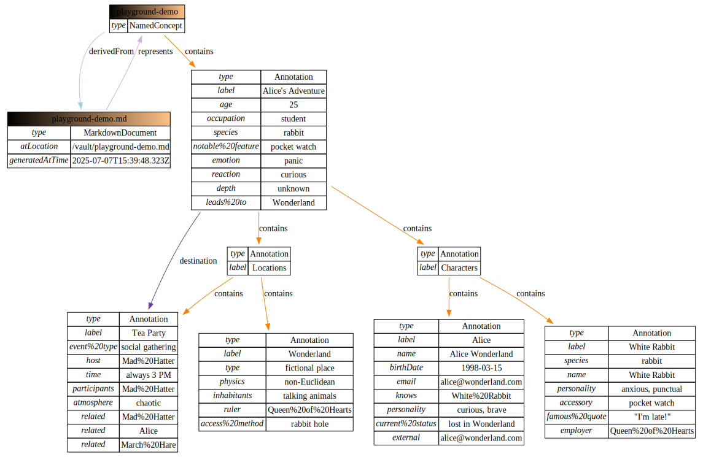

# Vault Triplifier

Transform your markdown documents into semantic RDF knowledge graphs with simple, natural syntax.

## Quick Example (written by an LLM)

Transform a single markdown file with embedded semantic properties:

**alice-adventure.md**
```markdown
# Alice's Adventure

Alice (schema:age :: 25) (schema:occupation :: student) was walking through Oxford 
when she spotted a White Rabbit (species :: rabbit) (notable feature :: pocket watch) 
running past.

"I'm late!" exclaimed the rabbit (emotion :: panic) (destination :: [[#Tea Party]]).

Alice (reaction :: curious) decided to follow the rabbit down a mysterious hole 
(depth :: unknown) (leads to :: [[Wonderland]]).

## Characters

### Alice
schema:name :: Alice Wonderland
schema:birthDate :: 1998-03-15
schema:email :: alice@wonderland.com
foaf:knows :: [[White Rabbit]]
personality :: curious, brave
current status :: lost in Wonderland

### White Rabbit
schema:name :: White Rabbit
species :: rabbit
accessory :: pocket watch
personality :: anxious, punctual
famous quote :: "I'm late!"
employer :: [[Queen of Hearts]]

## Locations

### Tea Party
event type :: social gathering
host :: [[Mad Hatter]]
time :: always 3 PM
participants :: [[Alice]], [[Mad Hatter]], [[March Hare]]
atmosphere :: chaotic

### Wonderland
schema:type :: fictional place
physics :: non-Euclidean
inhabitants :: talking animals
ruler :: [[Queen of Hearts]]
access method :: rabbit hole
```

This generates semantic RDF triples that capture the relationships between characters, locations, and events:



```javascript
import { triplifyFile } from 'vault-triplifier'

const options = {
  partitionBy: ['headers-h1-h2-h3'],
  includeSelectors: true
}

const pointer = await triplifyFile('alice-adventure.md', options)
console.log(pointer.dataset.toString())
```

**Key Features Demonstrated:**
- **Inline semantics**: Properties embedded naturally in narrative text
- **Namespace support**: Standard vocabularies like `schema.org` and `foaf`  
- **Document partitioning**: Separate entities for Characters and Locations sections
- **Link relationships**: References between Alice, White Rabbit, and locations
- **Mixed syntax**: Both inline `(property :: value)` and block `property :: value` patterns


## Documentation (autogenerated, not reviewed)

- **[Quick Start](./generated_docs.md)** - Basic usage and API reference
- **[Complete Documentation](./docs/index.md)** - Comprehensive examples and guides
- **[Examples](./docs/examples/)** - Progressive tutorials from basic to advanced
- **[Syntax Reference](./docs/syntax-reference.md)** - Complete syntax guide
- **[Configuration](./docs/configuration.md)** - Options and customization

## Installation

```bash
npm install vault-triplifier
```

## Basic Usage

```javascript
import { triplifyFile } from 'vault-triplifier'

// Process a single file
const pointer = await triplifyFile('my-document.md')

// With custom options
const pointer = await triplifyFile('my-document.md', {
  partitionBy: ['headers-h1-h2', 'identifier'],
  includeSelectors: true
})

// Process entire directory
import { triplifyVault } from 'vault-triplifier'
const dataset = await triplifyVault('./my-vault/')
```

## Status

Expect the model to change as this is an experimental library
